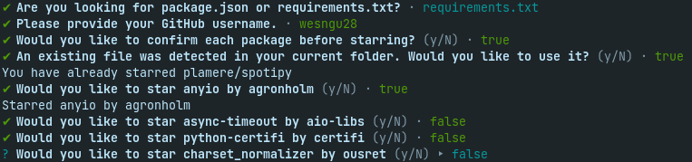

# auto-stargazing

🎵 Rollin', 🎵 rollin', 🎵 rollin', got me ⭐ stargazin' 🌠

Simple script written in Typescript to parse a npm generated package.json and a pip generated requirements.txt for their corresponding github repositories and stars them.

<p align="center">

</p>

## Installation/Running

You can run the script using npx by calling:

```
npx auto-stargazing
```

Alternatively, you can install it like a regular npm package and run it through node.

```
npm i auto-stargazing
```

To use this, you must provide your github personal access token in a .env or in the script context. [You can create a github personal access token here](https://docs.github.com/en/authentication/keeping-your-account-and-data-secure/creating-a-personal-access-token) 